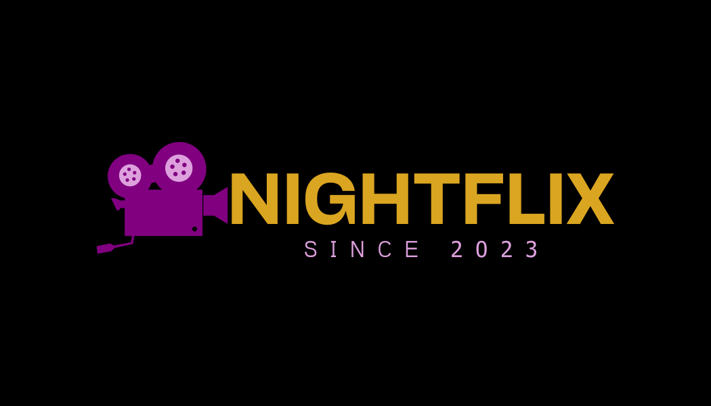

> 📌 **Note:** This project, NightFlix, is a snapshot of my early journey into full-stack development and particularly into React. It has several areas for improvement, and I'm fully aware of them. However, I've chosen to publicize it intentionally. Why? Because it allows you, the reader, to see my progress and development in React and full-stack development in general. As you explore my more recent projects, you'll notice a significant evolution in my coding practices and skills. Checkout (I will insert link when I deploy) this project to see my progession. Enjoy the journey!

    

<h6>Please read the pinned note about this project before proceeding.</h6>
<h2><a href="http://nightflix-app.com/">NightFlix</a></h2>
NightFlix is a web application that allows users to browse movies and TV shows, and add them to their watchlist. In the future, users will be able to interact with others and chat about their favorite movies and shows.

## 📚 Table of Contents
1. 💡 [Conceptualization](#conceptualization)
2. 🎨 [Design](#design)
3. 🚀 [Technology Stack](#technology-stack)
4. 🏗️ [Architecture](#architecture)
5. 🧗‍♂️ [Challenges and Learning Experiences](#challenges-and-learning-experiences)
6. 🧪 [Testing](#testing)
7. 🚀 [Deployment](#deployment)
8. 🛠️ [Maintenance](#maintenance)
    - ⚠️ [Known Issues](#known-issues)
    - 📝 [User Feedback](#user-feedback)

---

## 💡 Conceptualization
| Problem Statement | Target Audience | Why Choose NightFlix |
| --- | --- | --- |
| NightFlix provides a user-friendly interface that keeps movie enthusiasts up-to-date with both recent and classic releases. | Our platform caters to cinephiles worldwide, offering them a quick preview and comprehensive details about their favorite films. | NightFlix distinguishes itself with its intuitive design, enabling users to effortlessly dive into the action and connect with others by sharing their interests. |

## 🎨 Design
**User Interface & Experience**: NightFlix's user interface is a testament to simplicity and intuitiveness. The design journey began with inspiration from Netflix's theme, but it gradually evolved to adopt hues of light blue, purple, and gold. This color palette was chosen to evoke a cozy, nighttime ambiance, enhancing the user's movie browsing experience.

While developing NightFlix, my primary focus was on mastering **React** and its hooks, and seamlessly integrating these with the **MovieDB API** and the rest of the **MERN** stack. The goal was to ensure a user-friendly interface that promotes easy navigation throughout the application.

In the early stages, I experimented with **Material UI**, but soon realized that a solid understanding of React's foundations was essential for effective use. The current version of NightFlix uses a mix of CSS files and inline styling. Although not a best practice, it was a necessary step in the learning process and towards making the application functional.

## 🚀 Technology Stack
| Category | Technologies | Description |
| --- | --- | --- |
| **Frontend** | React, React Router DOM, CSS, Material-UI | React is used for building the user interface, with React Router DOM for routing, CSS for styling, and Material-UI for prebuilt components. |
| **Backend** | Node.js, Express, MongoDB, Mongoose, CORS, dotenv | Node.js and Express form the backend server. MongoDB is the database, with Mongoose as the ODM. CORS is used for handling cross-origin requests, and dotenv for managing environment variables. |
| **Testing** | Postman | Postman is used for testing the API endpoints. |
| **Deployment** | AWS, Ubuntu | The application is deployed on an AWS EC2 instance running Ubuntu. |

## 🏗️ Architecture
The **front-end** is built using **React**, a popular JavaScript library for building user interfaces. The application is structured into views, which are further divided into components and pages. This modular approach allows for better code reusability and easier maintenance. State management is handled using React's built-in hooks, ensuring a smooth user experience.

The **back-end** is powered by **Node.js** and **Express**, providing a robust and scalable server environment. The application follows the MVC (Model-View-Controller) design pattern, with routes, controllers, and models each having their own responsibilities. This separation of concerns results in cleaner, more organized code.

Data persistence is achieved through **MongoDB**, a NoSQL database known for its flexibility and scalability. The database design focuses on embedding documents where possible, to reduce the need for complex joins and improve query performance.

In the future, I plan to incorporate additional features and technologies into NightFlix, such as real-time updates using WebSockets and improved state management with Redux or Context API. I also aim to enhance the test coverage and implement continuous integration/continuous deployment (CI/CD) for more efficient development workflows. 

## 🧗‍♂️ Challenges and Learning Experiences
Building NightFlix was a journey filled with challenges, each one offering a unique learning opportunity. One of the primary hurdles was mastering **React's hooks**. Transitioning from vanilla HTML, CSS, and JavaScript to React was a significant leap. Grasping the intricacies of hooks required considerable time and effort, leading to several learning moments, such as understanding the importance of securing API keys, optimizing API calls, and managing state effectively.

These experiences were invaluable, helping me delve deeper into React and its capabilities. They also underscored the importance of robust error handling, organized code structure, and the value of clean, readable code. Looking back, I realize that more emphasis on planning and architecture at the outset would have streamlined the development process. Despite the challenges, I am proud of the solid foundation I've built in React and am excited to continue honing my skills.

On the server-side, I felt more at ease. Implementing a **RESTful API**, learning about the **MVC design pattern**, and structuring a **Node.js** application were areas where I excelled. I also deepened my understanding of **MongoDB** and its effective use for data persistence.

However, the journey doesn't end here. I acknowledge that there's much more to learn about React and front-end development. My plan is to continue refining my skills and building more complex applications to solidify my understanding of these concepts. As I progress, I will update [link here] with a project that showcases my evolving grasp of React, preserving NightFlix as a testament to my growth.

## 🧪 Testing
At the time of creating NightFlix, I was not fully aware of the importance and methodologies of testing in software development. As such, the project does not include formal unit, integration, or end-to-end tests.

However, I did use **Postman** for API testing and regression testing, which helped ensure the reliability of the server-side functionality.

Since then, I have recognized the critical role that testing plays in building robust and reliable software. In future projects, I plan to incorporate more comprehensive testing practices right from the start. I aim to use testing frameworks such as Jest for unit testing and Cypress for end-to-end testing, in addition to Postman for API testing. This will ensure that all components and functionalities work as expected and that any bugs or issues are identified and resolved promptly.

## 🚀 Deployment
This application is deployed on an **AWS EC2** instance running **Ubuntu**. The deployment process involved setting up the server environment, installing the necessary dependencies, and configuring the application to run on the server. The application is hosted on a custom domain, which is connected to the EC2 instance using **GoDaddy**. Please visit [NightFlix](http://nightflix-app.com/) to explore the deployed application.

| Category | Technology | Usage |
| --- | --- | --- |
| **Cloud Platform** | AWS EC2 | The cloud service used to host the application |
| **Operating System** | Ubuntu | The operating system on the EC2 instance |
| **Database** | MongoDB Atlas | The cloud database service used for storing application data |
| **Process Manager** | PM2 | The process manager used for managing the application process |
| **Text Editor** | VIM/nano | The text editors used for editing files on the server |
| **Domain Connection** | GoDaddy | The domain registrar used for connecting the domain to the application |

## 🛠️ Maintenance
As of now, I have no plans to actively maintain NightFlix. While this may seem unusual, it's important to note that this project serves as a snapshot of my early coding journey. Since its creation, I've gained substantial knowledge and experience, and my coding style and practices have evolved significantly.

While I acknowledge that the code for NightFlix isn't reflective of my current abilities, I choose to view it as a testament to my growth and progress in the field of software development. It stands as a reminder of where I started and how far I've come. 

Moving forward, I'm excited to apply my enhanced skills and knowledge to new projects, which will more accurately represent my current capabilities. I look forward to sharing these future projects as they come to fruition.

### ⚠️ Known Issues
While NightFlix is functional, it does have several known issues that I am aware of:

- **Spaghetti code**: The code structure could be more organized and modular. This is something I've improved upon in my more recent projects.
- **Exposed API keys**: The API keys used in this project are exposed, which is not a best practice for security. In my current projects, I use environment variables to securely store sensitive information.
- **Multiple API calls in a function**: Some functions make multiple API calls, which can slow down the application and lead to inefficient code. I've since learned to optimize API calls for better performance.
- **Poor use of Material UI**: My understanding of Material UI was limited at the time of this project, leading to less than optimal usage. I've since gained a deeper understanding of this library and how to effectively use it in my projects.

I've chosen to leave these issues as they are to provide a clear contrast between this project and my more recent work. This allows viewers to see the progress and development in my coding practices and skills over time.

### 📝 User Feedback
I greatly value user feedback as it helps me improve and refine my projects. If you have any comments, suggestions, or feedback about NightFlix, I would love to hear from you. You can reach out to me via GitHub or by sending an email to [jcsandoval978@gmail.com](mailto:jcsandoval978@gmail.com). Your input can play a significant role in shaping the future development of this project and my upcoming work.